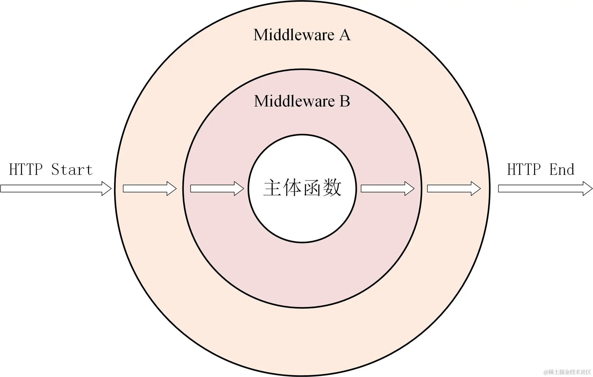

## Web 中间件
- HTTP / RPC 请求必经的一个中间层,该中间层可以统一处理所有的请求
- Gin 的中间件是一个 HandlerFunc,它的签名是 func(c *gin.Context)
  - 基于洋葱模型,中间件可以在请求前后做一些事情
    - 请求前置拦截： Web 请求到达我们定义的 HTTP 请求处理方法之前，拦截请求并进行相应处理
    - 请求后置拦截： 在处理完成请求并响应客户端时，拦截响应并进行相应的处理
  - 

### 1. 自定义中间件
- RequestID()
  - 在每一个 HTTP 请求的 context, response 中注入 `X-Request-ID` 字段
    - 注入上下文有助于服务器端的处理过程中跟踪请求
    - 注入响应头有助于客户端获取请求的唯一标识
  - 其作用是为每一个请求生成一个唯一的 ID,方便日志追踪

## 2. Gin 中间件
- NoCache()
  - 禁用客户端缓存 HTTP 请求的响应
- Cors
  - 处理浏览器的跨域请求
- Secure
  - 添加 HTTP 安全相关的响应头

